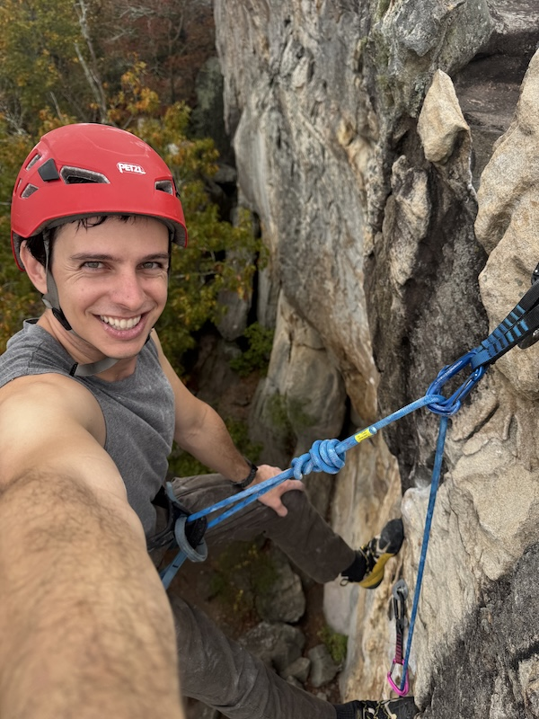

# Hi there, I'm Joey 👋

  

**Backend software engineer** with a focus on **Python**, **FastAPI**, **DevOps**, and cloud systems. I care about shipping solid software and working well with teams. Right now I'm at **Zoro.com**, building high-performance e-commerce backend services.

Outside of work: late-night coding, camping in our **Airstream**, **3D printing**, and fixing everyday problems with **CAD**.

## Tech stack

**Languages & frameworks**  
Python · FastAPI · REST APIs · SQL · PostgreSQL · Redis

**DevOps & cloud**  
GCP · Docker · Kubernetes · CI/CD · GitHub Actions · Terraform

## Projects

- **[Foodu8.com](https://foodu8.com)**
- **[simple-ai-commit](https://github.com/jrmusan/simple-ai-commit)** — Minimal bash CLI that suggests git commit messages from staged changes via [OpenRouter](https://openrouter.ai/)
- **[mediapipe_gesture_recognition](https://github.com/jrmusan/mediapipe_gesture_recognition)** — Straightforward Python demo: MediaPipe GestureRecognizer with live camera input
- **[hand-gesture-tv-remote](https://github.com/jrmusan/hand-gesture-tv-remote)** — Control a Samsung TV with hand gestures (MediaPipe); WIP toward a Raspberry Pi–friendly setup

## What I'm working on

- High-performance e-commerce backend services at **Zoro.com**
- Side projects after hours
- The next 3D-printed fix for a problem I didn’t know I had

## Fun facts

- Love to travel the country in our 16ft Airstream — waking up somewhere new never gets old
- I’m deep into **3D printing** and love designing things to solve real-world problems
- My best commits tend to happen after midnight
